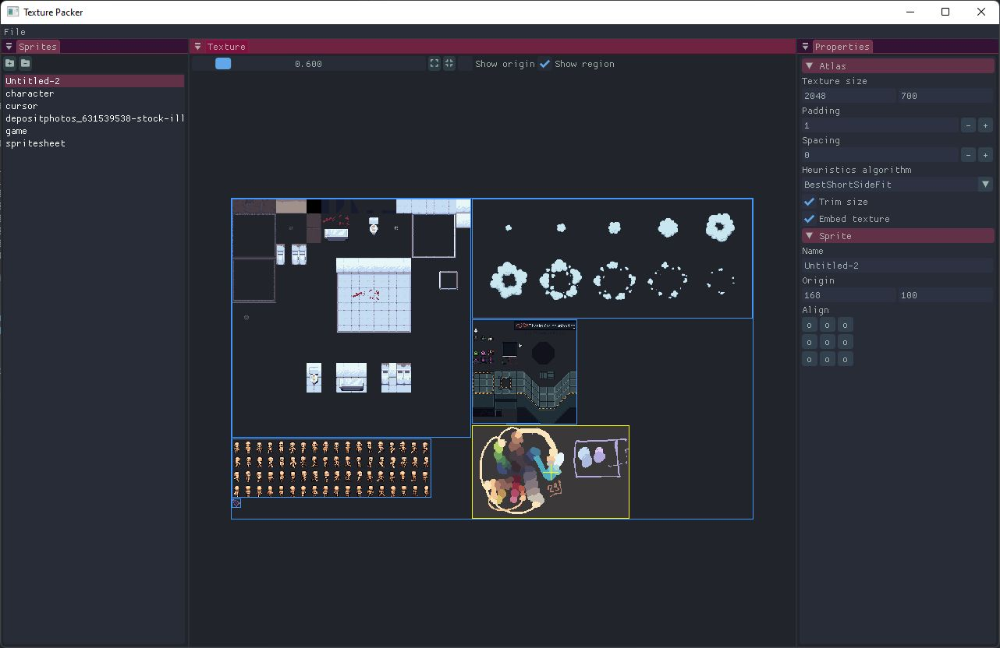

# Texture Packer

### Building from command line
You don't have to open VS to build the project. Just run `msbuild raylib-template.sln`.\
**Warning**: you **have** to use the `Developer command prompt for VS`, otherwise this won't work!
